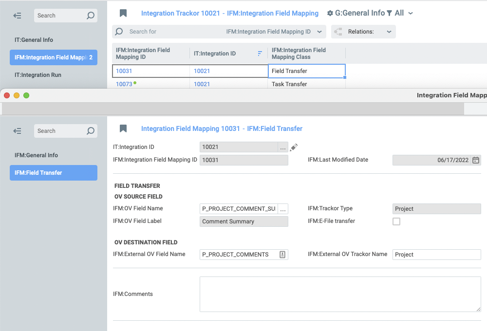

# pass_data_from_ov_to_ov

Module for migration of data from one OneVizion installation to another OneVizion installation

## Usage
1. Add the module to the Integration Hub, and import components. After that, enable the related rules and automations.
2. Create and fill IntegrationTrackor and IntegrationFieldMapping Trackor Types.
    * In IntegrationTrackor, you need to fill in the following fields:
        a. IT:Integration Type = "OV to OV"
        b. IT:Link to Integration Hub - this should be filled with the link to the module from Integration Hub
        c. IT:OV Source Trigger - this should contain the field and its value by which the received Trackors will be filtered.
           The value should be in equal(FIELD_NAME,FIELD_VALUE) format
           Examples:
           equal(P_SEND_IT10021_TO_SANDBOX,1)
           equal(P_SEND_IT10021_TO_SANDBOX,"text")
        d. IT:OV Source Clear Trigger - this should contain the field and its value, by which the filter will be reset, if all data of this Trackor are moved.
           The value should be in the format {"FIELD_NAME": FIELD_VALUE}
           Examples:
           {"P_SEND_IT10021_TO_SANDBOX":0}
           {"P_SEND_IT10021_TO_SANDBOX»:"text»}
        e. IT:OV Source Trackor Type - here you should specify the Trackor Type from which you want to get the values to move
        f. IT:OV Source Workplan Name - here you should specify Workplan Name from which the values for moving will be got
        g. IT:OV Source Key Field - the key by which the data from the source will be filtered in the destination
        h. IT:OV Destination Trackor Type - the same as item 5, only for the destination
        i. IT:OV Destination Workplan Name - the same as item 6 for the destination
        j. IT:OV Destination Key Field - the same as item 7, only for the destination
        k. IT:Integration Enabled - for the module to consider this Integration Trackor, it should be enabled.
        l. IT:Integration Error and IT:Integration Error Message are filled with a rule that triggers after the module executes with an error.
    
    * You also need to add IntegrationFieldMapping for each field/task:
        a. IFM:OV Field Name - you should select field whose data should be transferred, only fields for Trackor Type specified in IT:OV Source Trackor Type field can be selected.
           If this field is E-File type, then IFM:E-File transfer field will also be filled, because E-File is transferred in separate way.
        b. IFM:External OV Field Name - name of the destination field, where the data will be transferred
        c. IFM:OV Workplan Task - you should select the task you want to transfer.
        d. It is also necessary to fill in the IFM:Task S/F and IFM:Task Date Pair fields, on the basis of these fields the IFM:Task Data field, which is used by the module for data transfer, will be filled in.
        e. IFM:External Order Number - the order number of the destination task, to which the data will be transferred
    
    

3. Fill out the module settings file. See the example below, all of the required fields that you needed to fill out in step 2 are already contained there, you only need to fill in ovSourceUrl, ovSourceAccessKey and ovSourceSecretKey, as well as the same data for Destination

Example of settings.json

```json
{
    "ovSourceUrl": "https://***.onevizion.com/",
    "ovSourceAccessKey": "******",
    "ovSourceSecretKey": "************",
    "ovSourceTrackorType": "IntegrationTrackor",
    "ovMappingTrackorType": "IntegrationFieldMapping",

    "ovDestinationUrl": "https://***.onevizion.com/",
    "ovDestinationAccessKey": "******",
    "ovDestinationSecretKey": "************",

    "ovSourceFields": {
        "id": "TRACKOR_ID",
        "key": "TRACKOR_KEY",
        "type": "TRACKOR_CLASS_ID",
        "status": "IT_INTEGRATION_ENABLED",
        "trigger": "IT_OV_SOURCE_TRIGGER",
        "clearTrigger": "IT_OV_SOURCE_CLEAR_TRIGGER",
        "sourceTrackorType": "IT_OV_SOURCE_TRACKOR_TYPE",
        "sourceKeyField": "IT_OV_SOURCE_KEY_FIELD",
        "sourceWP": "IT_OV_SOURCE_WORKPLAN_NAME",
        "destinationTrackorType": "IT_OV_DESTINATION_TRACKOR_TYPE",
        "destinationKeyField": "IT_OV_DESTINATION_KEY_FIELD",
        "destinationWP": "IT_OV_DEST_WORKPLAN_NAME"
    },
    "ovSourceTypes": {
        "ovToOv": "OV to OV"
    },
    "ovSourceStatus": {
        "enabled": 1
    },
    "ovEfileTransfer": {
        "yes": "1"
    },
    "ovMappingFields": {
        "mappingClass": "TRACKOR_CLASS_ID",
        "efileTransfer": "IFM_EFILE_TRANSFER",
        "sourceFieldName": "IFM_OV_FIELD_NAME",
        "destinationFieldName": "IFM_EXTERNAL_OV_FIELD_NAME",

        "sourceOrderNumber": "IFM_ORDER_NUMBER",
        "sourceTaskData": "IFM_TASK_DATA",
        "destinationOrderNumber": "IFM_EXTERNAL_ORDER_NUMBER"
    },
    "ovTaskFields": {
        "wpId": "id",
        "wpActive": "active",
        "taskLabel": "label",
        "taskDateType": "date_type_id",
        "taskDynamicDates": "dynamic_dates"
    },
    "ovMappingTypes": {
        "fieldTransfer": "Field Transfer",
        "taskTransfer": "Task Transfer"
    }
}
```